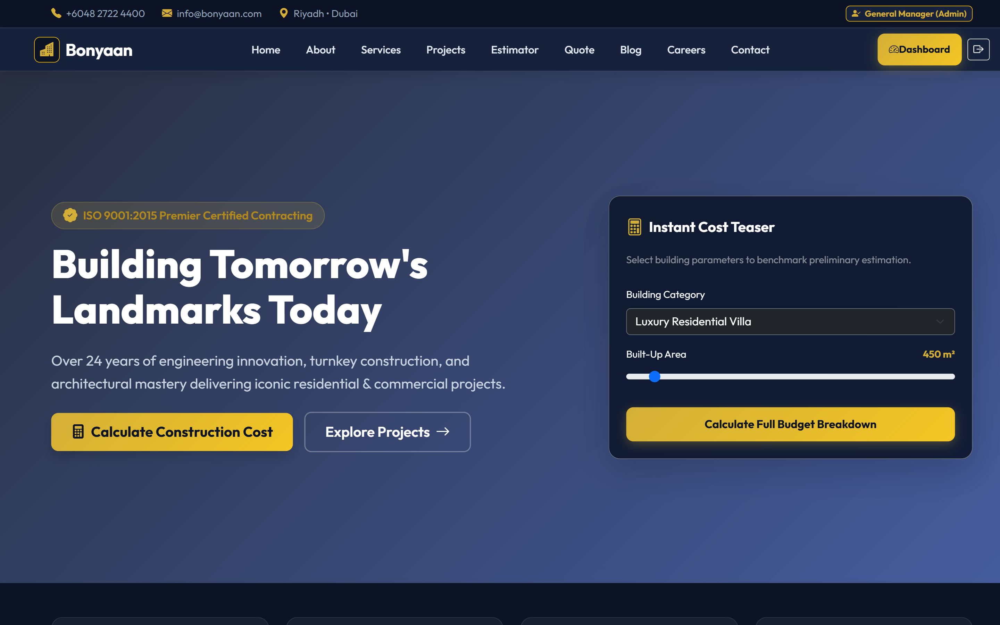
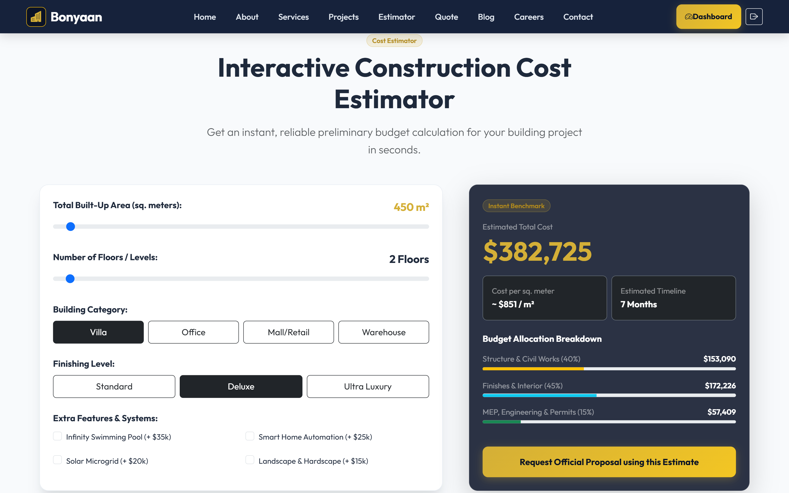
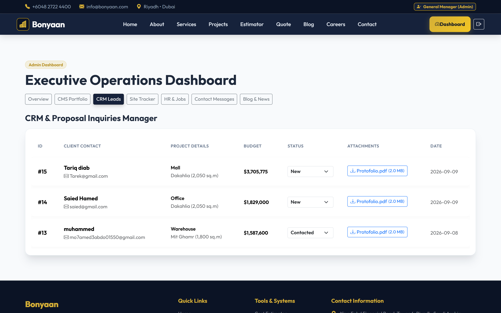
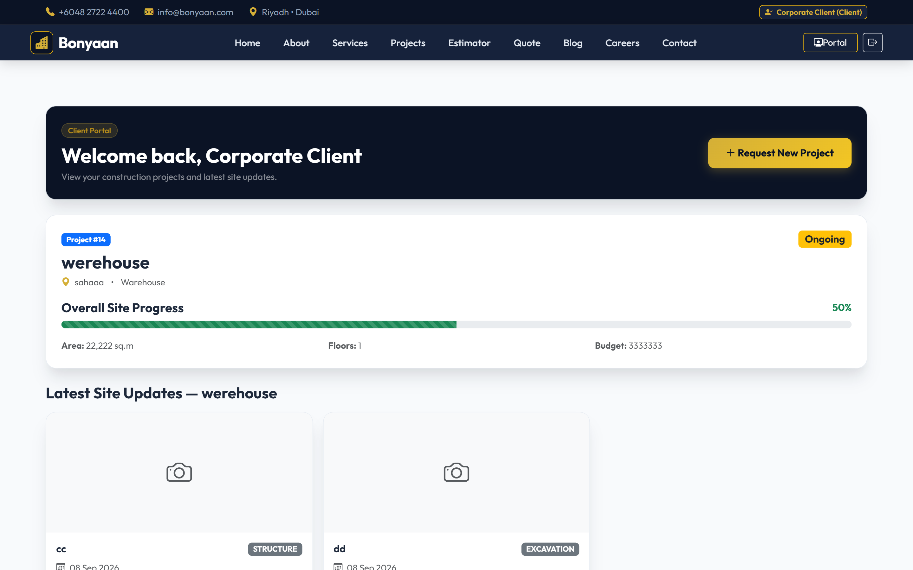

<p align="center">
  
</p>

<h1 align="center">Bonyaan</h1>
<p align="center">A full-stack construction & contracting platform — from an instant cost estimate to a live, photo-tracked build.</p>

<p align="center">  
 
 

 </p>

<p align="center">
  <a href="#-live-demo">Live Demo</a> ·
  <a href="#-features">Features</a> ·
  <a href="#-tech-stack">Tech Stack</a> ·
  <a href="#-getting-started">Getting Started</a> ·
  <a href="#-testing">Testing</a>
</p>

---

## 🖼️ Preview

| Homepage                               | Cost Estimator                               |
| -------------------------------------- | -------------------------------------------- |
|  |  |

| Admin — CRM Leads                           | Client Portal — Site Tracker                       |
| ------------------------------------------- | -------------------------------------------------- |
|  |  |

<p align="center">
  
</p>

## 🚀 Live Demo

🔗 **[bonyaan-demo.example.com](https://bonyaan-demo.example.com)**

| Role   | Email                 | Password   |
| ------ | --------------------- | ---------- |
| Admin  | `admin@bonyaan.test`  | `password` |
| Client | `client@bonyaan.test` | `password` |

> Demo data is reset periodically. Feel free to explore every role without affecting real data.

## ✨ Features

Bonyaan isn't a template — every workflow below is wired end-to-end, from a public form, through validation and file storage, into an admin decision, and back out to the client.

### For visitors & clients

- **Instant cost estimator** — server-side calculation based on area, build type, and finish level, protected by reCAPTCHA v3
- **Quote requests with attachments** — upload site plans/drawings; each request becomes a lead in the admin CRM
- **Contact form** — automatic confirmation + admin notification emails (Brevo)
- **Careers** — job listings with CV upload
- **Blog** — published articles with individual post pages
- **Client Portal** — logged-in clients see only _their own_ projects
- **Request a new project** directly from the portal — enters the admin's review queue as `pending`
- **Live site tracker** — photo updates per construction phase (excavation → structure → MEP → finishing), with an auto-calculated overall progress bar

### For admins

- **Overview dashboard** — live KPI counts across leads, sites, applicants, and messages
- **CRM** — every estimator/quote submission, with downloadable attachments and status tracking
- **CMS** — manage the project portfolio; accept or decline client-submitted project requests
- **Site Tracker** — post dated, photo-backed progress updates per project and phase
- **HR** — review applicants and download CVs
- **Blog & News** — full CRUD for site articles
- **Contact Messages** — track and resolve inbound inquiries

## 🛠️ Tech Stack

| Layer           | Choice                                                            |
| --------------- | ----------------------------------------------------------------- |
| Backend         | PHP 8.3, Laravel 13                                               |
| Database        | SQLite (testing) / MySQL (production)                             |
| Frontend        | Bootstrap 5, vanilla JS (fetch-based JSON APIs, no SPA framework) |
| Auth            | Session-based, role-gated via Laravel Gates (`admin` / `client`)  |
| Spam protection | Google reCAPTCHA v3 (score + action verification)                 |
| Email           | Brevo (transactional: contact confirmations, admin alerts)        |
| Testing         | PHPUnit / `php artisan test` — 14 feature & unit tests            |

## ⚙️ Getting Started

```bash
git clone git@github.com:Muhammed-abdo-host/Bonyaan_System.git
cd Bonyaan_System

composer install
cp .env.example .env
php artisan key:generate

php artisan migrate
php artisan storage:link

php artisan serve
```
